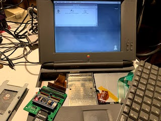

# PowerBook adapter for BlueSCSI

https://github.com/xunker/bluescsi_pb

This project allows you to use [BlueSCSI](https://github.com/erichelgeson/BlueSCSI) (STM32 SCSI emulator) in the Apple PowerBook, or in any other device that uses 40-pin 2.5in mobile SCSI devices.

# Gerber Files

[version 1.1](v1.1/gerber) - current

[version 1.0](v1.0/gerber) - provided for history only, DO NOT USE

# Board

## 40-pin connector (J1)

This is a 2.0mm, two-row, right angle header connector. It connects to the ribbon cable inside the PowerBook. Most ribbon cables have a "key pin" located at pin 17. If this is the case, you will need to break that pin off the connector on your board. The side the key is located on is indicated by the "[" symbol.

## 8-pin connector (J2)

This is also a 2.0mm, two-row, right angle header connector, located to the right of the 40-pin connector. This connector is **not required* for operation, you do not have to solder headers to it if you don't want to.

This is used in some, but not all, PowerBooks. For example, it *is* present in my PowerBook 520c but it is *not present* in my PowerBook 145.

In some systems, it is used to change the SCSI ID of the drive, trigger spin-up and provide an activity LED. Since BlueSCSI selects SCSI IDs based on filename then this is not needed.

## 50-pin connector (J8)

This is provided to connect to a desktop SCSI connection. If you only intend to use this inside a PowerBook then this is not required.

If you do not use a shrouded connector, then you can still know the correct orientation of the SCSI cable by looking for the "[" symbol next to the connector, which represents the key cutout in a shrouded connector.

## Termination Resistors Packs and Termination Enable Jumpers (J4, J5)

Solder two 220-ohm and two 330-ohm in to the correct positions. Please note the position of pin 1, it is different on either side.

Solder 2 standard 2.54mm header pins to J4 and J5, and then cap them with a jumper/shunt to enable termination.

## MicroSD card (J3) and SD Card Breakout (J7)

Pad J3 is used for a Molex 104031-0811 MicroSD card slot.

If you do not have the correct part (or don't like soldering SMD, which is totally understandable), you can also solder 2.54mm male headers to an SD-to-MicroSD adapter and connect it to J7.

# Caveats

## Termination

Although documentation for the [IBM DHAS-2270](https://stason.org/TULARC/pc/hard-drives-hdd/ibm/DHAS-2270-TRAVELSTAR-270MB-2-5-SSL-SCSI2-FAST.html) drive that originally came in my PowerBook 520c claims:

> The drive does not have termination nor pull up resistors for SCSI interface

.. I have found that this adapter does not want to work as the internal drive unless you enable termination. The PB 520c *does* supply termination power to the internal drive (although it *does not* supply it to the external HDI-30 SCSI connector).

## Clearance

Most SCSI PowerBooks used 17mm-tall SCSI drives. In order for this board to fit in that height, you will either need to permanently solder the STM32 module directly to the bluescsi_pb board or to use ["low-profile" female headers](https://www.adafruit.com/product/3008). If you use standard-height headers, you will need a space of 19-20mm.

Even with low-profile headers, you may have to bend the "boot select" jumpers on the top of the STM32 module off to the side.

## Using the 50-pin connector at the same time as the 40-pin connector

I recommend that you do **not** use the 50-pin and 40-pin connectors at the same time. If you know what you are doing then you are welcome to try, but please *be careful*.

# Credits

This project would not be possible without the work done by [ztto](https://github.com/ztto/ArdSCSino-stm32), [Tambo](https://twitter.com/h_koma2), [Eric Helgeson](https://github.com/erichelgeson/BlueSCSI), and many others.

The "Blue Pill" footprint was originally created by [Yet-Another-Average-Joe](https://github.com/yet-another-average-joe/Kicad-STM32).

# License

See [LICENSE.md](LICENSE.md).
