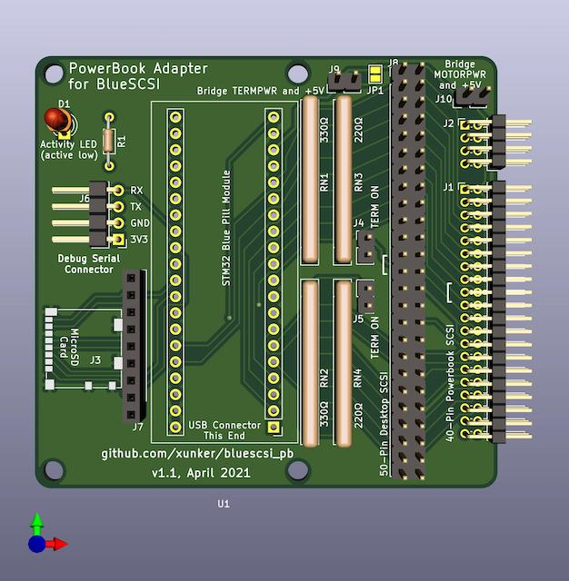

<!-- TOC ignore:true -->
# PowerBook adapter for BlueSCSI

<!-- TOC -->

- [PowerBook adapter for BlueSCSI](#powerbook-adapter-for-bluescsi)
- [About](#about)
- [Compatibility](#compatibility)
- [Board Versions and Gerber Files](#board-versions-and-gerber-files)
  - [Future versions of the board](#future-versions-of-the-board)
- [Board Tour](#board-tour)
  - [J1 40-pin mobile SCSI connector](#j1-40-pin-mobile-scsi-connector)
  - [J2 8-pin connector](#j2-8-pin-connector)
  - [J8 50-pin desktop SCSI connector](#j8-50-pin-desktop-scsi-connector)
  - [Termination Resistors Packs and Termination Enable Jumpers J4, J5](#termination-resistors-packs-and-termination-enable-jumpers-j4-j5)
  - [MicroSD card J3 and SD Card Breakout J7](#microsd-card-j3-and-sd-card-breakout-j7)
  - [Power selection jumpers](#power-selection-jumpers)
    - [Powering board by motor power MOTORPWR](#powering-board-by-motor-power-motorpwr)
    - [Repowering board by termination power TERMPWR](#repowering-board-by-termination-power-termpwr)
    - [Powering board by USB alone](#powering-board-by-usb-alone)
  - [Activity LED D1](#activity-led-d1)
- [Bill of Materials](#bill-of-materials)
- [Caveats](#caveats)
  - [Termination](#termination)
  - [Ribbon cable should not be seated fully on connector J1 for me, at least](#ribbon-cable-should-not-be-seated-fully-on-connector-j1-for-me-at-least)
  - [Clearance](#clearance)
  - [Using the 50-pin connector at the same time as the 40-pin connector](#using-the-50-pin-connector-at-the-same-time-as-the-40-pin-connector)
- [Credits](#credits)
- [License](#license)

<!-- /TOC -->

# About

https://github.com/xunker/bluescsi_pb

This project allows you to use [BlueSCSI](https://github.com/erichelgeson/BlueSCSI) (STM32 SCSI emulator) in the Apple PowerBook, or in any other device that uses 40-pin 2.5in mobile SCSI devices.

# Compatibility

Successfully used with my PowerBook 520c using the 40-pin connector. I have **not** yet been able to make it work with my PowerBook 145, however.

Using the 50-pin connector, I have successfully used it with an Apple IIgs, a Macintosh Classic II and a Macintosh LC.

# Board Versions and Gerber Files

* [version 1.1](v1.1/) (April 2021) - current
* [version 1.0](v1.0/) (March 2021) - deprecated, not recommended

## Future versions of the board

See [FUTURE_PLANS.md](FUTURE_PLANS.md).

# Tour of board v1.1

## J1 (40-pin mobile SCSI connector)

This is a 2.0mm, two-row, right angle header connector. It connects to the ribbon cable inside the PowerBook. Most ribbon cables have a "key pin" located at pin 17. If this is the case, you will need to break that pin off the connector on your board. The side the key is located on is indicated by the "[" symbol.

## J2 (8-pin connector)

This is also a 2.0mm, two-row, right angle header connector, located to the right of the 40-pin connector. This connector is **not required* for operation, you do not have to solder headers to it if you don't want to.

This is used in some, but not all, PowerBooks. For example, it *is* present in my PowerBook 520c but it is *not present* in my PowerBook 145.

In some systems, it is used to change the SCSI ID of the drive, trigger spin-up and provide an activity LED. Since BlueSCSI selects SCSI IDs based on filename then this is not needed.

## J8 (50-pin desktop SCSI connector)

This is provided to connect to a desktop SCSI connection. If you only intend to use this inside a PowerBook then this is not required.

If you do not use a shrouded connector, then you can still know the correct orientation of the SCSI cable by looking for the "[" symbol next to the connector, which represents the key cutout in a shrouded connector.

## Termination Resistors Packs and Termination Enable Jumpers (J4, J5)

Solder two 220-ohm and two 330-ohm in to the correct positions. Please note the position of pin 1, it is different on either side.

Solder 2 standard 2.54mm header pins to J4 and J5, and then cap them with a jumper/shunt to enable termination.

## MicroSD card (J3) and SD Card Breakout (J7)

Pad J3 is used for a Molex 104031-0811 MicroSD card slot.

If you do not have the correct part (or don't like soldering SMD, which is totally understandable), you can also solder 2.54mm male headers to an SD-to-MicroSD adapter and connect it to J7.

## Power selection jumpers

By default the board is powered by SCSI termination power (`TERMPWR`), and is controlled by the joint JP1 (which is near J9).

### Powering board by motor power (`MOTORPWR`)

If you want to have the board be powered by +5 motor power (`MOTORPWR`) instead of `TERMPWR`, you must
* Break joint **JP1** with a small knife
* Solder a 2-pin header to **J10** and short it with a removable jumper cap

This will power the Blue Pill module from `MOTORPWR`, but *SCSI termination* will still be powered by `TERMPWR`.

### (Re)powering board by termination power (`TERMPWR`)

If JP1 is broken and you want reconnect the board back to `TERMPWR`, you must either:
* Solder a 2-pin header to **J9** and short it with a removable jumper cap

.. or ..

* Resolder **JP1**

### Powering board by USB alone

If you want to power the Blue Pill module from USB power, you must:
* Break joint **JP1** with a small knife
* Ensure that **J9** AND **J10** are **NOT** shorted

## Activity LED (D1)

This is a breakout of the built-in LED that reflects disk activity. It is the same as the LED on the Blue Pill module itself. This part is **optional** and the module will work without it.

The signal is active-low, and current-limiting resistor for the LED is on the *positive* (anode) side of the LED. This way you can tap in to the cathode (negative) pin of the LED footprint to monitor drive activity from an external device directly if you need to do that.

# Bill of Materials

See [BOM.md](BOM.md).
# Caveats

## Termination

Although documentation for the [IBM DHAS-2270](https://stason.org/TULARC/pc/hard-drives-hdd/ibm/DHAS-2270-TRAVELSTAR-270MB-2-5-SSL-SCSI2-FAST.html) drive that originally came in my PowerBook 520c claims:

> The drive does not have termination nor pull up resistors for SCSI interface

.. I have found that this adapter does not want to work as the internal drive unless you enable termination. The PB 520c *does* supply termination power to the internal drive (although it *does not* supply it to the external HDI-30 SCSI connector).

## Ribbon cable should not be seated fully on connector J1 (for me, at least)

On my PowerBook 520c, seating the drive cable fully on to connector J1 causes the BlueSCSI module to not work. I have found that leaving the ribbon cable *slightly* (like, 1mm maybe) off the connector makes the connection much more reliable. See picture below so see how much I am talking about:

[Click here](images/j1_ribbon_recommended_gap_thumb.jpg) for larger version of above.

## Clearance

Most SCSI PowerBooks used 17mm-tall SCSI drives. In order for this board to fit in that height, you will either need to permanently solder the STM32 module directly to the bluescsi_pb board or to use ["low-profile" female headers](https://www.adafruit.com/product/3008). If you use standard-height headers, you will need a space of 19-20mm.

Even with low-profile headers, you may have to bend the "boot select" jumpers on the top of the STM32 module off to the side.

## Using the 50-pin connector at the same time as the 40-pin connector

I recommend that you do **not** use the 50-pin and 40-pin connectors at the same time. If you know what you are doing then you are welcome to try, but please *be careful*.

# Credits

This project would not be possible without the work done by [ztto](https://github.com/ztto/ArdSCSino-stm32), [Tambo](https://twitter.com/h_koma2), [Eric Helgeson](https://github.com/erichelgeson/BlueSCSI), and many others.

The "Blue Pill" footprint was originally created by [Yet-Another-Average-Joe](https://github.com/yet-another-average-joe/Kicad-STM32).

# License

See [LICENSE.md](LICENSE.md).
