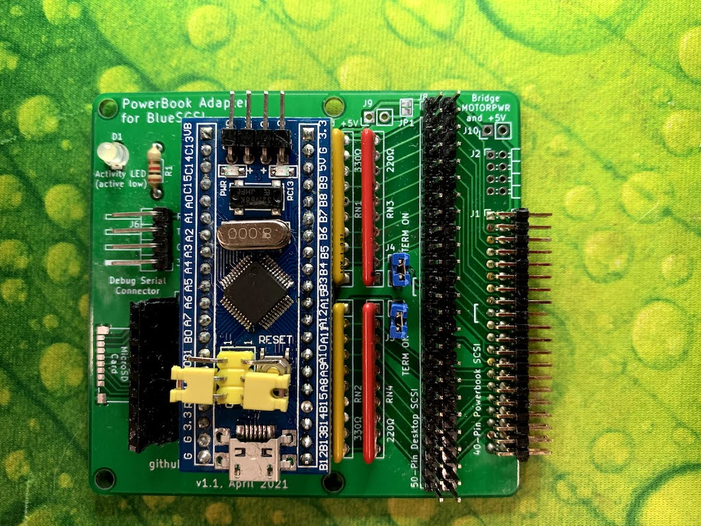
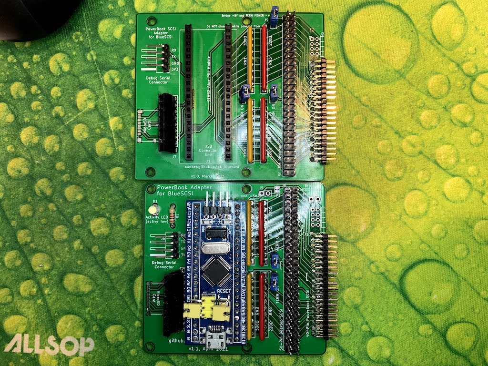
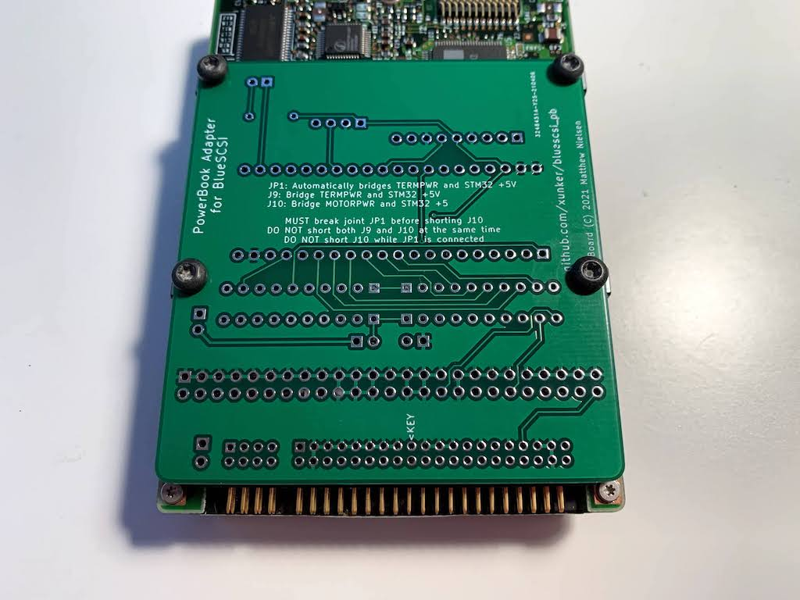

# PowerBook adapter for BlueSCSI, v1.1

https://github.com/xunker/bluescsi_pb/v1.1

## April 2021

This design is the current design. It replaces [v1.0](../v1.0).

## Gerber files

Gerber files can be [found here in the gerber directory](gerber).

## Changes from v1.0

Changes in order of importance:
* Mounting hole locations adjusted so they match an actual drive
* Connect `RETURN` on 40-pin SCSI connector with signal ground
* STM32 +5 is connected to `TERMPWR` by default, via breakable jumper pad
* Separate jumpers provided for powering via `TERMPWR` or `MOTORPWR`
  - *MOTORPWR* is a separate +5v provided to run the drive motor and actuator
  - This change will be helpful for debugging power issues where *MOTORPWR* appears to be inconsistent
* Activity LED (`LED_BUILTIN`) broken-out if you want to have an external LED
* Increased `TERMPWR` trace width
* Traces and resistor packs are moved farther away from mounting holes to avoid potential shorts
* Back silkscreen marks location of the key pin (17) within the 40-pin connector
* Moved legends for J1, J2 and J8 so they are next to pin 1 on their respective connectors
* Corners rounded more
* Numerous changes to the routing of traces
* Shorten board by about 5mm
  - This is the shortest practical length to maintain all four screw holes

## Comparison with 2.5in drive

A 2.5 inch SCSI drive is 100mm x 70mm. This version of bluescsi_pb is 72mm x 67mm, or 77mm x 67mm once the 40-pin connector is attached.

